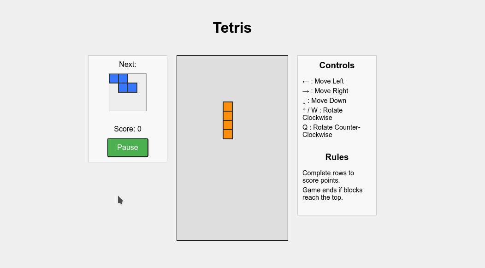

# Tetris Game in JavaScript

## Original Project Functionality

This project implements a classic Tetris game using JavaScript, HTML5 Canvas, and CSS. The core functionality includes:

* **Gameplay Area:** A 12x20 grid where Tetris blocks fall.
* **Tetrominoes:** Seven standard Tetris shapes (I, L, J, O, S, T, Z) with distinct colors.
* **Random Piece Generation:** New tetrominoes are generated randomly.
* **Movement Controls:** Players can move the falling tetromino left, right, and down using arrow keys.
* **Rotation:** Tetrominoes can be rotated clockwise (Up arrow or 'W') and counter-clockwise ('Q').
* **Collision Detection:** Prevents tetrominoes from moving through existing blocks or the board boundaries.
* **Board Merging:** Once a tetromino reaches the bottom or collides with existing blocks, it merges with the game board.
* **Line Clearing:** When a horizontal line of blocks is filled, it is cleared, and the blocks above shift down.
* **Scoring:** Points are awarded for clearing lines, with bonus points for clearing multiple lines simultaneously.
* **Game Over:** The game ends if new tetrominoes spawn and immediately collide with existing blocks at the top of the board.
* **Start/Pause Button:** Allows players to start a new game or pause/resume the current game.
* **Next Piece Preview:** A small canvas displays the upcoming tetromino.
* **Score Display:** Shows the player's current score.
* **Controls and Rules:** A side panel provides a quick reference for game controls and rules.

## Added Features with Screenshots

**1. Next Piece Preview:**

   This feature enhances gameplay by showing the player the upcoming tetromino, allowing for strategic planning.

   ```Screenshot```
   
   
**2. Start/Pause Functionality:**

   The "Start" button initiates the game, and the text toggles to "Pause" during gameplay, allowing the player to temporarily halt the action. Pressing "Pause" changes the text to "Resume" and stops tetromino movement until clicked again. The "Restart" functionality appears on game over.

**3. Game Over Overlay:**

   When the game ends, a visual overlay with "GAME OVER" is displayed on the game area, clearly indicating the end of the current game.


**4. Basic Scoring System:**

   A score counter is implemented, updating in real-time as the player clears lines. The scoring system provides increasing points for clearing multiple lines at once.


**5. Clear Instructions and Rules:**

   A dedicated right-side panel provides easily accessible information on the game controls and the basic rules of Tetris.


## Implementation Process
The Tetris game was implemented using the following steps:

**1. HTML Structure (index.html):** Set up the basic layout with a title, the main game canvas (#tetris), a preview canvas (#next), a score display (#score), a start/pause button (#start-pause), a game over overlay (#game-over-overlay), and a side panel for controls and rules. The style.css is linked for styling, and tetris.js is linked at the end of the body to ensure the DOM is loaded before the script runs.

**2. CSS Styling (style.css - not provided, assuming basic styling):** Basic CSS was used to style the game container, canvases, score display, button, and overlay to create a visually appealing and functional layout.


**3. JavaScript Logic (tetris.js):** 

* *Canvas Initialization:* Retrieved the main and next piece canvases and their 2D rendering contexts. Set the scale for block size.

* *Game State Management:* Variables were used to track the current game state (playing, paused, gameOver).

* *Game Board Representation:* A 2D array (board) was created to represent the game board, with 0 indicating an empty cell and numbers corresponding to the color of the block in that cell.

* *Tetromino Shapes and Colors:* Defined the shapes of the seven Tetris tetrominoes as 2D arrays and an array of colors corresponding to each shape.

* *Drawing Functions:* drawSquare, drawMatrix, and drawNextPiece were implemented to render blocks and tetrominoes on the canvases.

* *Game Logic:*

* * createBoard: Initializes an empty game board.
* * createBoard: Initializes an empty game board.
* * merge: Merges the falling tetromino into the game board.
* * rotate: Rotates a tetromino matrix clockwise or counter-clockwise.
* * playerRotate: Rotates the current player's tetromino, including basic wall kick logic to prevent rotation through walls.
* * boardSweep: Checks for and clears completed rows, updating the score.
* * generateNewPiece: Randomly selects a new tetromino shape.
* * playerReset: Resets the player's piece, generates the next piece, and checks for game over.
* * collide: Detects collisions between the player's tetromino and the board.
* * playerMove: Moves the player's tetromino left or right.
* * playerDrop: Moves the player's tetromino down, handling collisions and merging.

* *Game Loop (update and draw):* Implemented a game loop using requestAnimationFrame for smooth animation. The update function handles game timing and the draw function renders the current game state.

* *Keyboard Input:* Event listeners were added to capture keyboard presses for movement and rotation controls.

* *Button Control:* An event listener was added to the start/pause button to toggle the game state and handle game restarts.

* *Initial Setup (initGame):* Initializes the game board, score, and first pieces.


## Challenges Faced and Solutions


**1. Game Over Condition:**
Accurately detecting when the game should end (when a new piece cannot be placed at the top of the board) required a specific check during the playerReset function.

* * Solution: The collide function is called immediately after resetting the player's position with a new piece. If a collision occurs at the spawn point, the gameState is set to 'gameOver', and the game over overlay is displayed.

**2. Next Piece Preview Implementation**
Rendering the next piece required a separate canvas and logic to draw the tetromino centered within it, using the same block drawing functions but on a different context.

* * Solution: The drawNextPiece function was created, which clears the next canvas and then draws the player.nextMatrix in the center of the nextCanvas. The scaling was adjusted to ensure the preview fits correctly.


## Aider Commands Used and Their Effectiveness

* *build a Tetris game using javascript.*
* *write JavaScript functions for moving the tetromino left, right, and down.*
* *implement a game over condition.*
* *add a 'next piece' preview to the UI.*
* *add start pause button.*
* *add GAME OVER overlay text.*
* *add instructions for moving arrows.*


